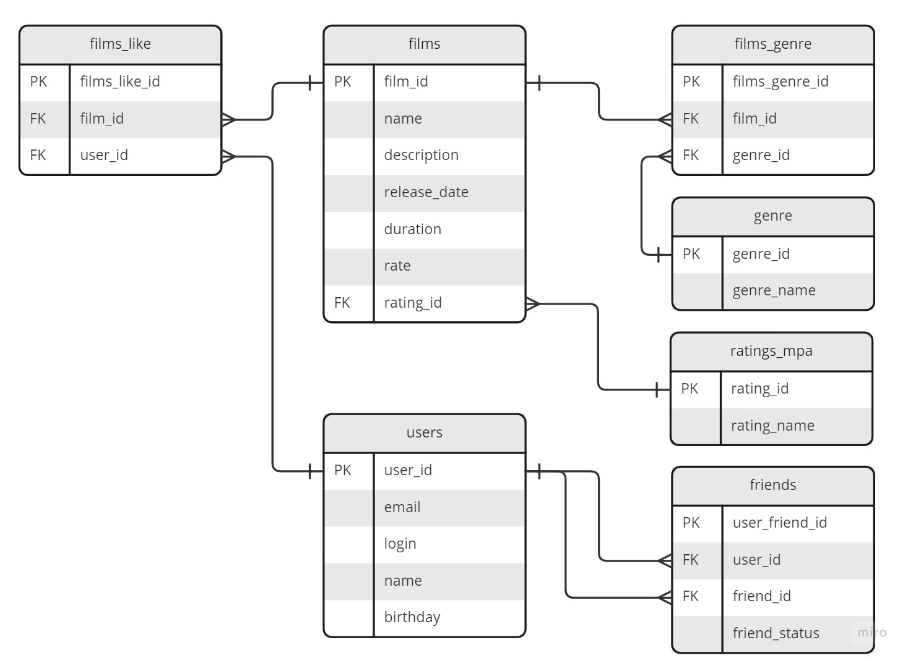

<h1 align="center">Filmorate</h1>
<h2 align="center">
</h2>

## Описание
Программа Filmorate предназначена для работы с фильмотекой в части хранения и получения информации о фильмах 
зарегистрированными пользователями. 

### Хранение данных
Хранение данных осуществляется в базе данных под управлением СУБД H2.

### Схема хранения данных в СУБД
<p align="center">
</p>

#### Таблица <font color="green">films</font> - хранит информацию о фильмах:
- <font color="grey">film_id</font> - уникальный идентификатор фильма;
- <font color="grey">name</font> - название фильма;
- <font color="grey">description</font> - краткая информация о фильме;
- <font color="grey">release_date</font> - дата выхода фильма в прокат;
- <font color="grey">duration</font> - продолжительность фильма в минутах;
- <font color="grey">rate</font> - итоговый рейтинг фильма;
- <font color="grey">rating_id</font> - идентификатор рейтинга MPA фильма, является внешним ключём к таблице <font color="green">ratings_mpa</font>.

#### Таблица <font color="green">users</font> - хранит информацию о пользователях:
- <font color="grey">user_id</font> - уникальный идентификатор пользователя;
- <font color="grey">email</font> - адрес электронной почты пользователя;
- <font color="grey">login</font> - логин пользователя;
- <font color="grey">name</font> - имя пользователя;
- <font color="grey">birthday</font> - день рождения пользователя.

#### Таблица <font color="green">films_like</font> - хранит информацию о поставленных пользователями лайках:
- <font color="grey">films_like_id</font> - уникальный идентификатор лайка, поставленного пользователем;
- <font color="grey">film_id</font> - уникальный идентификатор фильма, которому поставлен лайк. Внешний ключ к таблице <font color="green">films</font>;
- <font color="grey">user_id</font> - уникальный идентификатор пользователя, кпоставившего лайк фильму. Внешний ключ к таблице <font color="green">users</font>.

#### Таблица <font color="green">films_genre</font> - хранит информацию о жанрах для каждого фильма:
- <font color="grey">films_genre_id</font> - уникальный идентификатор записи таблицы;
- <font color="grey">film_id</font> - уникальный идентификатор фильма. Внешний ключ к таблице <font color="green">films</font>;
- <font color="grey">genre_id</font> - уникальный идентификатор жанра. Внешний ключ к таблице <font color="green">genre</font>.

#### Таблица <font color="green">genre</font> - справочник жанров фильмов:
- <font color="grey">genre_id</font> - уникальный идентификатор жанра;
- <font color="grey">genre_name</font> - название жанра.

#### Таблица <font color="green">ratings_mpa</font> - справочник рейтингов Системы рейтингов Американской киноассоциации (англ. MPAA film rating system)
- <font color="grey">rating_id</font> - уникальный идентификатор рейтинга MPAA;
- <font color="grey">rating_name</font> - название рейтинга MPAA.

#### Таблица <font color="green">friends</font> - хранит сведения о дружбе пользователей:
- <font color="grey">user_friend_id</font> - уникальный идентификатор таблицы;
- <font color="grey">user_id</font> - идентификатор пользователя, добавивший другого пользователя(<font color="grey">friend_id</font>) в друзья. Внешний ключ к таблице <font color="green">users</font>;
- <font color="grey">friend_id</font> - идентификатор пользователя, которого в друзья первым добавил другой пользователь (<font color="grey">user_id</font>) в друзья. Внешний ключ к таблице <font color="green">users</font>;
- <font color="grey">friend_status</font> - статус дружбы пользователей <font color="grey">user_id</font> и <font color="grey">friend_id</font>. Если <font color="yellow">false</font> - пользователь <font color="grey">friend_id</font> является другом пользователя <font color="grey">user_id</font>, если <font color="yellow">true</font> - пользователи дружат между собой.

<span>______________________________________________________________________________________________________________________________________</span>
## Типовые запросы, используемые для работы с базой данных.

### Добавление, обновление и получение информации о фильмах

#### Получение информации о фильме с определённым<font color="grey">film_id</font></ins>
Например, получим информацию о фильме с <font color="grey">film_id</font></ins>=1:
1.Получаем информацию о фильме из таблицы <font color="green">films</font>:
```
select f.FILM_ID,f.NAME,f.DESCRIPTION,f.RELEASE_DATE,f.RELEASE_DATE,f.DURATION,f.RATE,
       rm.RATING_ID,rm.RATING_NAME,g.GENRE_ID,g.GENRE_NAME 
from films f 
LEFT JOIN 
RATINGS_MPA rm 
ON f.RATING_ID =rm.RATING_ID 
LEFT JOIN FILMS_GENRE fg 
ON f.FILM_ID =fg.FILM_ID 
LEFT JOIN GENRE g 
ON fg.GENRE_ID =g.GENRE_ID 
WHERE f.FILM_ID=1;
```

<span>______________________________________________________________________________________________________________________________________</span>

#### Получение информации обо всех фильмах
1.Получаем информацию обо всех фильмах:
```
select f.FILM_ID ,f.NAME ,f.DESCRIPTION ,f.RELEASE_DATE ,f.RELEASE_DATE ,f.DURATION ,f.RATE ,
       rm.RATING_ID ,rm.RATING_NAME ,g.GENRE_ID ,g.GENRE_NAME 
from films f 
LEFT JOIN 
RATINGS_MPA rm 
ON f.RATING_ID =rm.RATING_ID 
LEFT JOIN FILMS_GENRE fg 
ON f.FILM_ID =fg.FILM_ID 
LEFT JOIN GENRE g 
ON fg.GENRE_ID =g.GENRE_ID 
ORDER BY f.FILM_ID;
```

<span>______________________________________________________________________________________________________________________________________</span>
#### Добавление фильма
1.Добавляем информацию о фильме в таблицу <font color="green">films</font>:
```
INSERT INTO films(name,description,release_date,duration,rate,rating_id) VALUES("film_name","film_description","2020-12-01",180,5,2);
```
В результате выполнения запроса получаем идентификатор вновь добавленного фильма(film_id), например = 10.

2.Добавляем информацию о рейтинге MPAA фильма в таблицу <font color="green">films_genre</font>:
Добавим, например 2 жанра фильму с genre_id=5 и genre_id=7.
```
insert into films_genre(film_id,genre_id) VALUES(10,5);
insert into films_genre(film_id,genre_id) VALUES(10,7);
```
<span>______________________________________________________________________________________________________________________________________</span>
#### Обновление информации о фильме
1.Обновляем информацию о фильме в таблице <font color="green">films</font>:
Например, обновляем информацию о фильме со следующими характеристиками:
- <font color="grey">film_id</font>: 1;
- <font color="grey">name</font>: "Фильм 1";
- <font color="grey">description</font>: "Фильм о приключениях.";
- <font color="grey">release_date</font>: '2019-05-12';
- <font color="grey">duration</font>: 159;
- <font color="grey">rate</font>: 9;
- <font color="grey">rating_id</font>: 3;
- <font color="grey">genre_id</font>: 2;
- <font color="grey">genre_id</font>: 5;
```
UPDATE films SET name='"'Фильм 1',description='Фильм о приключениях.',release_date='2019-05-12',duration=159,rate=9,rating_id=3 WHERE film_id=1;
```
2.Добавляем информацию о жанрах фильма в таблицу <font color="green">films_genre</font>

```
insert into films_genre(film_id,genre_id) VALUES(1,2);
insert into films_genre(film_id,genre_id) VALUES(1,5);
```
<span>______________________________________________________________________________________________________________________________________</span>
#### Удаление фильма
Например, удалим фильм следующий фильм:
- <font color="grey">film_id</font>: 1;
```
delete from films where film_id= 1;
```
<span>______________________________________________________________________________________________________________________________________</span>
#### Получение списка самых популярных фильмов
Получим, например, 5 самых популярных фильмов. Полученные фильмы будут отсортированы в порядке убывания популярности, от самого популярного до самого непопулярного.
```
SELECT f2.FILM_ID ,f2.NAME ,f2.DESCRIPTION ,f2.RELEASE_DATE ,f2.RELEASE_DATE ,f2.DURATION ,f2.RATE,
       rm.RATING_ID ,rm.RATING_NAME ,g.GENRE_ID ,g.GENRE_NAME 
FROM (
        SELECT f.* 
        FROM FILMS f 
        LEFT JOIN 
        (SELECT FILM_ID,COUNT(*) cLike 
            FROM FILMS_LIKE 
            GROUP BY FILM_ID
        ) fl 
        ON fl.FILM_ID=f.FILM_ID 
        ORDER BY clike DESC limit(5)
     ) f2 
     LEFT JOIN RATINGS_MPA rm 
     ON f2.RATING_ID =rm.RATING_ID 
     LEFT JOIN FILMS_GENRE fg 
     ON f2.FILM_ID =fg.FILM_ID 
     LEFT JOIN GENRE g 
     ON fg.GENRE_ID =g.GENRE_ID;
```
<span>______________________________________________________________________________________________________________________________________</span>
### Добавление, обновление и получение информации о пользователях

#### Добавление пользователя
Например, добавим следующего пользователя:
- <font color="grey">email</font>: "user1@email.ru";
- <font color="grey">login</font>: "user1_login";
- <font color="grey">name</font>: "user1_name";
- <font color="grey">birthday</font>: '1995-12-01'.

```
INSERT INTO users(email,login,name,birthday) VALUES('user1@email.ru','user1_login','user1_name','1995-12-01');
```
<span>______________________________________________________________________________________________________________________________________</span>

#### Обновление данных о пользователе
Например, обновим данные следующего пользователя:
- <font color="grey">user_id</font>: 1;
- <font color="grey">email</font>: "user1_update@email.ru";
- <font color="grey">login</font>: "user1_login_update";
- <font color="grey">name</font>: "user1_name_update";
- <font color="grey">birthday</font>: '2000-11-02'.
```
UPDATE users SET email='user1_update@email.ru',login='user1_login_update',name='user1_name_update',birthday='2000-11-02' WHERE user_id=1;
```
<span>______________________________________________________________________________________________________________________________________</span>

#### Получение данных обо всех пользователях

```
select * from users;
```

<span>______________________________________________________________________________________________________________________________________</span>

#### Получение данных о конкретном пользователе
Например, получем данные о пользователе с <font color="grey">user_id</font>=1
```
select * from users where user_id=1;
```
<span>______________________________________________________________________________________________________________________________________</span>

#### Добавление друзей пользователем
Например, пользователь <font color="grey">user_id</font>=1 добавляет в друзья пользователя с <font color="grey">friend_id</font>=2.
1.Считываем является ли уже пользователи с <font color="grey">user_id</font> и <font color="grey">friend_id</font> друзьями по отношению друг к другу:
```
select user_id, friend_id, friend_status from friends where (user_id=1 and friend_id=2) or (user_id=2 and friend_id=1);
```
2.1.Если пользователь <font color="grey">friend_id</font>=2 уже добавил в друзья пользователя <font color="grey">user_id</font>=1, то обновляем статус дружбы до true (обоюдная)
```
UPDATE friends SET user_id=?,friend_id=?,friend_status=?;
```
2.2.Если пользователи не являются по отношению друг к другу друзьями, то добавляем для пользователя 1 друга пользователя 2.

```
INSERT INTO friends(user_id,friend_id) VALUES(1,2);
```
<span>______________________________________________________________________________________________________________________________________</span>

#### Удаление друга пользователя
Например, удалим для пользователя <font color="grey">user_id</font>=1 удалим друга пользователя с <font color="grey">friend_id</font>=2.
1.Считываем является ли уже пользователи с <font color="grey">user_id</font> и <font color="grey">friend_id</font> друзьями по отношению друг к другу:
```
select user_id, friend_id, friend_status from friends where (user_id=1 and friend_id=2) or (user_id=2 and friend_id=1);
```
2.Удаляется запись о дружбе пользователей 1 и 2.
```
DELETE FROM friends WHERE (user_id=1 and friend_id=2) OR (user_id=2 and friend_id=1);
```
3.Если на шаге 1 получили ответ, что дружба является обоюдной между 2-мя пользователями, то добавляем следующую запись
```
INSERT INTO friends(user_id,friend_id) VALUES(2,1);
```
Т.е. после шага 3 пользователь 1 может быть другом пользователя 2, но не наоборот.
<span>______________________________________________________________________________________________________________________________________</span>

#### Получение списка всех друзей пользователя
Например, получим список всех друзей пользователя <font color="grey">user_id</font>=1:
```
SELECT u2.* FROM USERS u2 LEFT JOIN 
(SELECT DISTINCT CASE WHEN (f.FRIEND_ID =1 AND f.FRIEND_STATUS) THEN f.USER_ID ELSE f.FRIEND_ID END AS FRIEND_ID FROM FRIENDS f
 WHERE f.USER_ID =1 OR (f.FRIEND_ID =1 AND f.FRIEND_STATUS)) fr ON u2.USER_ID =fr.FRIEND_ID WHERE fr.FRIEND_ID IS NOT NULL;
```

<span>______________________________________________________________________________________________________________________________________</span>

#### Получение общих друзей двух пользователей
Например, получим список общих друзей пользователей <font color="grey">user_id</font>=1 удалим друга пользователя с <font color="grey">other_id</font>=2.
```
SELECT * 
FROM USERS 
WHERE USER_ID IN 
    (SELECT f1.friend FROM 
        (SELECT 
            DISTINCT CASE WHEN (u.USER_ID =f.FRIEND_ID AND f.FRIEND_STATUS) THEN f.USER_ID ELSE f.FRIEND_ID END AS friend 
            FROM (
                    SELECT * 
                    FROM USERS  
                    WHERE USER_ID =1
                  ) u 
        LEFT JOIN 
        FRIENDS f 
        ON u.USER_ID =f.USER_ID OR (u.USER_ID =f.FRIEND_ID AND f.FRIEND_STATUS)
     ) f1 
     INNER JOIN 
        (SELECT 
            DISTINCT CASE WHEN (u.USER_ID =f.FRIEND_ID AND f.FRIEND_STATUS) THEN f.USER_ID ELSE f.FRIEND_ID END AS friend 
            FROM (
                    SELECT * 
                    FROM USERS  
                    WHERE USER_ID =2
                ) u 
        LEFT JOIN 
        FRIENDS f 
        ON u.USER_ID =f.USER_ID OR (u.USER_ID =f.FRIEND_ID AND f.FRIEND_STATUS)
     ) f2 
     ON f1.friend=f2.friend);
```
<span>______________________________________________________________________________________________________________________________________</span>
### Получение информации о названии конкретного рейтинга MPAA по <font color="grey">rating_id</font>
Например, получим название рейтинга MPAA с <font color="grey">rating_id</font>=1
```
select rating_id,rating_name from ratings_mpa where rating_id = 1;
```
<span>______________________________________________________________________________________________________________________________________</span>
### Получение информации обо всех рейтингах MPAA
```
select rating_id,rating_name from ratings_mpa order by rating_id;
```
<span>______________________________________________________________________________________________________________________________________</span>
### Получение информации о названии конкретного жанра по <font color="grey">genre_id</font>
Например, получим название жанра с <font color="grey">genre_id</font>=1

```
select genre_id,genre_name from genre where genre_id = 1;
```
<span>______________________________________________________________________________________________________________________________________</span>
### Получение информации обо всех жанрах
```
select genre_id,genre_name from genre order by genre_id;
```
<span>______________________________________________________________________________________________________________________________________</span>


